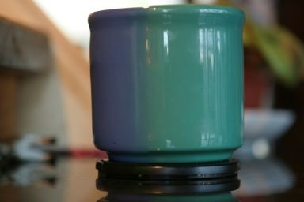
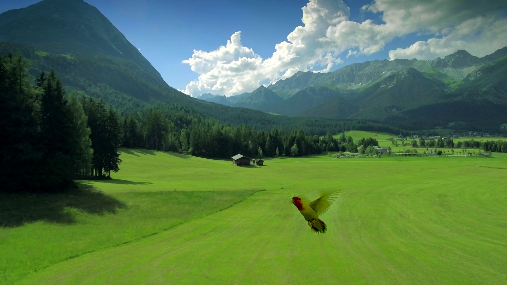

# Image Blending

### 1. Image Blending through Gaussian Pyramids

Note about the operation with uint8.

1. cv2.pyrUp and cv2.pyrDown requires input to be "uint8"
2. Gaussian Laplacian is the difference between original image and Gaussian filtered image after downsampling and upsampling. The substraction should be done with "signed" integers
3. Conversion from signed int to uint8 requires saturation check

```
>>> img = np.array([2000, -150, 11], dtype=np.int16)
>>> np.uint8(img)
array([208, 106,  11], dtype=uint8)
```


### 2. Image Blending through Poisson Blending
GetPolygon() specifies the blending region

cv2.seamlessClone() build-in function for Poisson blending


