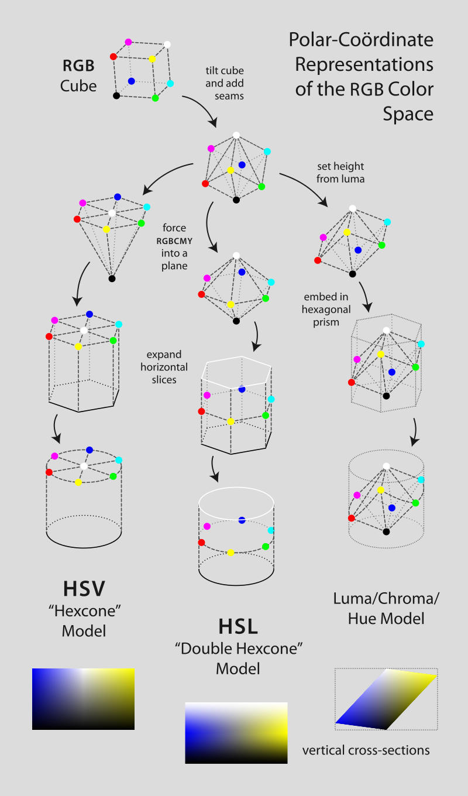

# Image Equalization

Apply equalization on different color spaces, e.g., LAB, YUV

### Color Space

http://colorizer.org/

https://en.wikipedia.org/wiki/HSL_and_HSV



### Gamma Correction
Using lookup table
```
invGamma = 1.0 / gamma
table = np.array([((i / 255.0) ** invGamma) * 255 for i in np.arange(0, 256)]).astype("uint8")
cv2.LUT(image, table)
```

Horizontal stacking of images
```    
if len(image_stack)>0:
    image_stack = np.hstack([image_stack, newimage])
else:
    image_stack = adjusted
```


### Normal Equalization
```
cv2.equalizeHist()
```


### Adaptive Equalization:   
```
clahe = cv2.createCLAHE()
clahe.apply(image)
```
