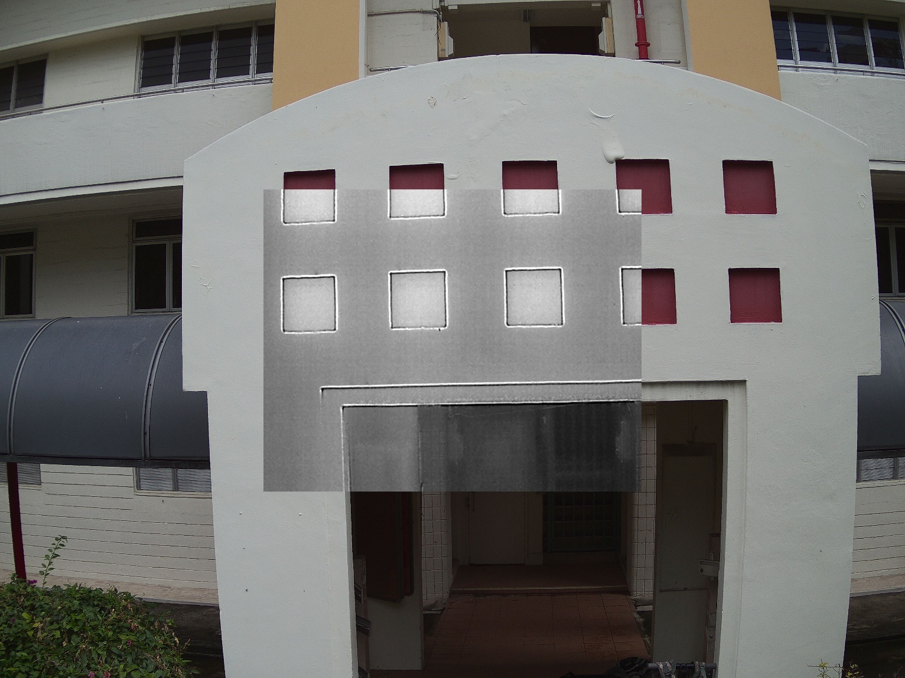

# Find Correspondence Between RGB and Thermal Images

Given one RGB image and one thermal image taken from DJI XT2

1. User specify two points on thermal and the corresponding two points on RGB (Left click to select point, Right click to clear all and restart)
2. Compute the scaling factor to scale up/down the RGB image
3. Embed the thermal image into the RGB image

### Showing Large Images in OpenCV
```
cv2.namedWindow('Image Demo', cv2.WINDOW_NORMAL)
h, w, c = self.im.shape
cv2.resizeWindow('Image Demo', int(480 / h * w), 480)
cv2.setMouseCallback('Image Demo', callBackFunction)

while (1):
    cv2.imshow('Image Demo', img)
    k = cv2.waitKey(1) & 0xFF
    if k == ord('q') or k == 27:
        break
cv2.destroyAllWindows()
```

### Parameters Saving and Loading
The mode has to be in binary 'b', i.e., 'wb' and 'rb'
```
# Saving Parameters
dict = {'scale': 1, 'x0': 2, 'y0': 3}
file = open('params', 'wb')
pickle.dump(dict, file)
file.close()

# Loading Parameters
file = open('params', 'rb')
dict = pickle.load(file)
```

